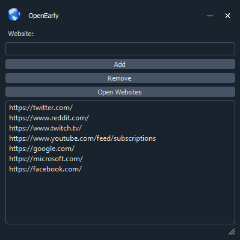

# OpenEarly

OpenEarly is a application that allows you to open a list of websites all at the same time

You can use this to open a list of websites when you wake up in the morning

The address bar at the top is where you paste the website that you want to add

All websites have to either start with https:// or http:// otherwise you will get an error

If you want to remove a website, all you have to do is click it, and then hit the 'Remove' button

If you want your websites to open in a different order than what is displayed, you can drag and drop them to the desired location

If you need to resize the window there is a grip you can drag in the bottom right

Click 'Open Websites' when you are ready and every website will open up at the same time
